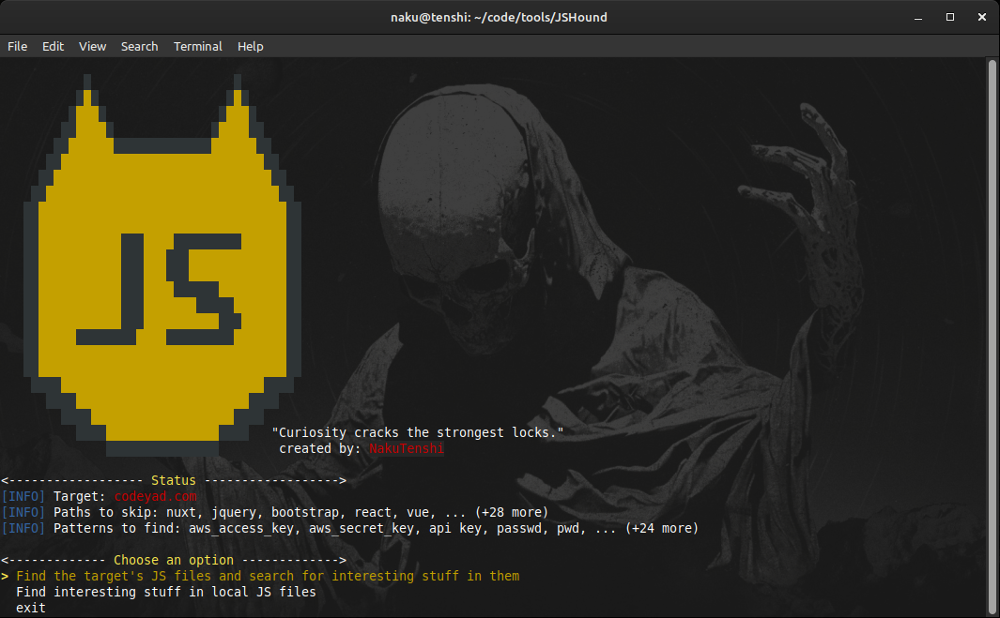

# JSHound 🐺

<div align="center">
  
  <p>JSHound: a tool for finding interesting things in JS files</p>
</div>

---



**JSHound**  is recon tool for bug bounty hunters and pentesters that extracts JavaScript files of target from multiple sources (Wayback Machine, Common Crawl, urlscan.io) and searches them for sensitive information such as API keys, tokens, and credentials. Supports online scanning, local analysis, and customizable wordlists for flexible recon workflows.

---

## Features
- 🔍 Collect JavaScript files from:
  - [Archive.org (Wayback Machine)](https://archive.org)
  - [Common Crawl](https://commoncrawl.org)
  - [urlscan.io](https://urlscan.io)
- 📥 Download JavaScript files locally for offline analysis
- 🕵️ Search for sensitive patterns (API keys, tokens, secrets, passwords, etc.)
- 🎛️ Interactive terminal menu for workflow selection
- 📂 Organized output saved in `./targets/<domain>/result/result.txt`
- ✨ Customizable:
  - Skip unwanted JS files (frameworks, libraries, etc.)
  - Use your own regex wordlist for pattern matching

---

## Installation

```bash
# Clone this repository
git clone https://github.com/yourusername/JSHound.git
cd JSHound
pip3 install -r requirements.txt

```

## Usage
```bash
python jshound.py -d <domain>
```

### Options

- `-d` : Target domain (required)  
  **Example:** `-d example.com`

- `-ps` : Comma-separated list of paths to exclude  
  **Example:** `-ps nuxt,node,jquery`

- `-w_ps` : Wordlist file containing paths to exclude  
  **Example:** `-w_ps ./pathdrop.txt`

- `-p` : Comma-separated list of patterns to search for  
  **Example:** `-p password,api_key,autotoken,token`

- `-w_p` : Wordlist file containing patterns to search for  
  **Example:** `-w_p ./patterns.txt`


## Output

All findings are saved in:
```
./targets/<domain>/result/result.txt
```

#### Each finding includes:
- The JS file path or URL
- The matching keyword/pattern
- Line number and line content

## Notes
- By default, common libraries (React, Vue, jQuery, etc.) are skipped.
- SSL warnings are disabled for easier fetching of JS files.
- If no matches are found, the tool will exit gracefully.

--- 
**Created By:** NakuTenshi
